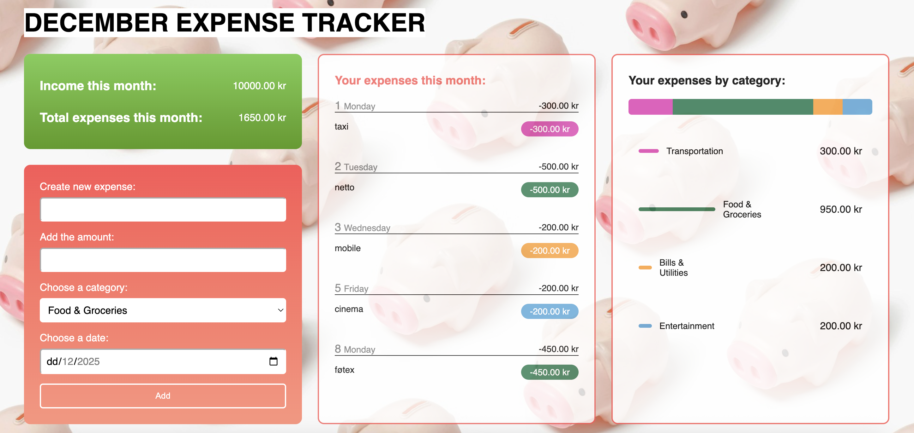

# Expense Tracker

A simple **Expense Tracker** that lets you log daily spendings, categorize expenses, view monthly total, and track your budget in real time. Built with **HTML, CSS, and JavaScript**.

---
## 🔹 Features

- Log your daily expenses
- Categorize spending (Housing, Food, Transport, Entertainment, etc.)
- View total expenses and income for the current month
- See expenses broken down by category with a visual bar chart
- Only allows adding expenses for the current month
- Dynamic heading showing the current month
- **LocalStorage** to save the data (income and expenses)

---
## 🔹 Screenshot

---
## 🔹 Live Demo

Check it out here: [Expense Tracker on GitHub Pages](https://nastiasolo.github.io/expense-tracker/)

---
