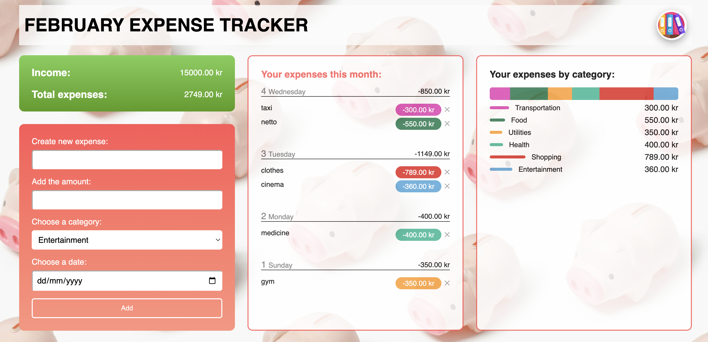

# Expense Tracker

A simple **Expense Tracker** that lets you log daily spendings, categorize expenses, view monthly total, and track your budget in real time. Built with **HTML, CSS, and JavaScript**.

---
## 🔹 Features

- Log your monthly income
- Categorize spendings (Housing, Food, Transport, Entertainment, etc.)
- View total expenses and income for the current month, expenses broken down by category with a visual bar chart
- Archive page with:
  -	Expenses grouped by year and month
  -	Monthly expense summaries
  -	Category-based expense visualization for each month
- **LocalStorage** to save the data (income and expenses)
- Modular JavaScript files for logic separation
- Deployed with GitHub Pages
  

---
## 🔹 Screenshot

---
## 🔹 Live Demo

Check it out here: [Expense Tracker on GitHub Pages](https://nastiasolo.github.io/expense-tracker/)

---
